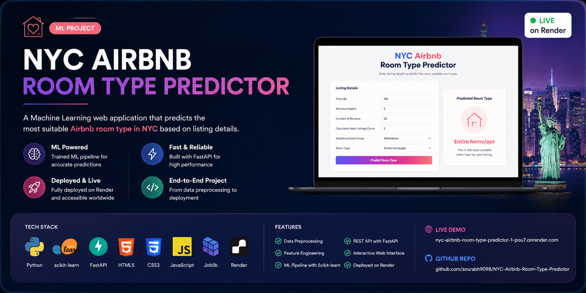
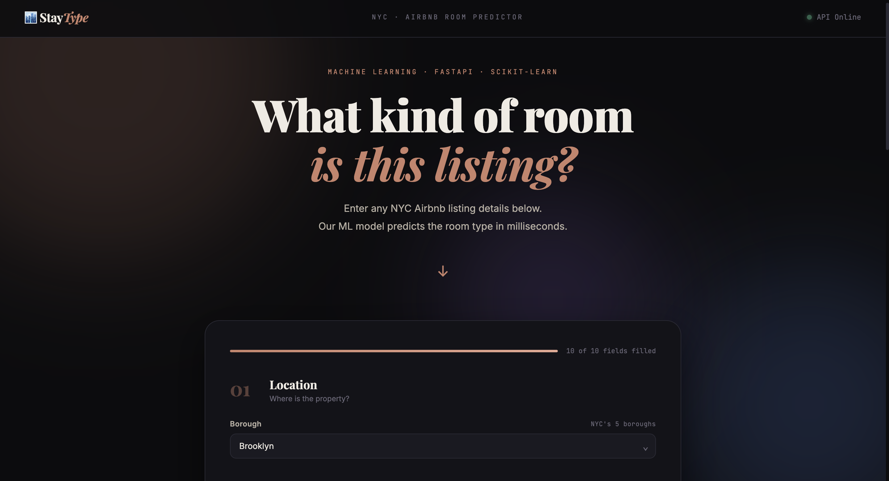

<div align="center">

<!-- Banner -->


<br/>

# 🏙️ StayType — NYC Airbnb Room Type Predictor

**A full-stack ML product. FastAPI backend · Scikit-learn Pipeline · Vanilla JS frontend**

<br/>


<br/>

</div>

---

## What This Is

A production-style ML API that predicts NYC Airbnb room types — **Entire home/apt**, **Private room**, or **Shared room** — from listing metadata like price, location, reviews, and host activity.

The frontend consumes the API in real time and shows the predicted room type with a full probability breakdown across all classes.

This isn't a Jupyter notebook wrapped in a Streamlit slider. It's a proper client-server architecture: **FastAPI** handles requests and inference, **HTML/CSS/JS** handles the UI, and they talk over REST.

---

## Live Preview



---

## Architecture

```
┌─────────────────────────────┐         ┌──────────────────────────────┐
│      Frontend (Port 5500)   │  POST   │     FastAPI (Port 8000)      │
│                             │ ──────► │                              │
│  index.html                 │  JSON   │  /predict                    │
│  styles.css                 │         │     ↓                        │
│  app.js                     │ ◄────── │  Pydantic validation         │
│                             │  JSON   │     ↓                        │
│  · Form validation          │         │  ML Pipeline                 │
│  · Progress tracking        │         │     ↓                        │
│  · Confidence bars          │         │  { prediction, probability } │
│  · API health check         │         │                              │
└─────────────────────────────┘         └──────────────────────────────┘
```

---

## ML Pipeline

The model is a `sklearn.pipeline.Pipeline` with:

| Step | Component | Purpose |
|------|-----------|---------|
| Preprocessing | `ColumnTransformer` | OneHotEncoder for categoricals, StandardScaler for numericals |
| Classifier | `RandomForestClassifier` | Multi-class room type prediction |
| Resampling | SMOTE | Handled class imbalance during training |

```json
{
  "prediction": "Entire home/apt",
  "probability": [[0.6538, 0.3158, 0.0303]]
}
```

---

## Api Reference

**Base URL :** `http://127.0.0.1:8000`

### `POST /predict`

```json
{
  "neighbourhood_group": "Brooklyn",
  "neighbourhood": "Williamsburg",
  "latitude": 40.71,
  "longitude": -73.95,
  "price": 150,
  "minimum_nights": 2,
  "number_of_reviews": 42,
  "reviews_per_month": 1.5,
  "calculated_host_listings_count": 3,
  "availability_365": 180
}
```

**Response:**
```json
{
  "prediction": "Entire home/apt",
  "probability": [[0.6538, 0.3158, 0.0303]]
}
```

**Pydantic validation rules:**
- `latitude` → -90 to 90
- `longitude` → -180 to 180
- `price` → gt 0
- `minimum_nights` → 1 to 365
- `availability_365` → 0 to 365

### `GET / home`
Health check — returns `200 OK` when API is live.

---

## Project Structure

```
statype/
├── main.py                  # FastAPI app, CORS config, /predict & /home routes
├── Model_Pipeline.pkl       # Trained sklearn Pipeline (serialized with joblib)
├── requirements.txt         # Python dependencies
│
├── index.html               # UI structure — 4-section form, result panel
├── styles.css               # Dark theme, animations, responsive layout
└── app.js                   # API calls, form validation, progress tracking,
                             # confidence bar rendering
```

---

## Running Locally

**1.  clone**
```bash
git clone https://github.com/sourabh9098/statype-room-predictor.git
cd statype-room-predictor
```

**2. Backend**
```bash
pip install -r requirements.txt
uvicorn main:app --reload
# API live at http://127.0.0.1:8000
```

**3. Frontend**

Open `index.html` with **Live Server** (VS Code extension) or any static file server:
```bash
# Using Python
python -m http.server 5500
# Open http://127.0.0.1:5500
```

> ⚠️ Open via a server, not by double-clicking the file — browser blocks CORS on `file://` protocol.

---

## Tech Stack

| Layer | Tech |
|-------|------|
| API Framework | FastAPI |
| Data Validation | Pydantic v2 |
| ML Pipeline | Scikit-learn 1.6 |
| Model Serialization | Joblib |
| Frontend | HTML5 · CSS3 · Vanilla JS (ES6+) |
| Fonts | Playfair Display · Inter · JetBrains Mono |
| Dev Server | Uvicorn |


## What I Built Into the Frontend

Most ML demos stop at the API I went further

- **Real-time API health check** — nav bar shows green/red dot based on `/home` ping every 30s
- **Live progress bar** — tracks how many of 10 fields are filled as you type
- **Field-level validation** — each input validates on blur with specific error messages, not a generic "required" toast
- **3-step loading animation** — "Processing features → Running pipeline → Computing probabilities"
- **Confidence breakdown** — animated bars for all 3 room type probabilities, sorted by confidence
- **Availability slider** — synced two-way between number input and range slider
- **Ambient background** — three colored blobs with CSS `blur` and `drift` animation

## Author

**Sourabh Vishwakarma**
Final Year B.Tech CSE ( AI )  Technocrats Institute of Technology , Bhopal

[](www.linkedin.com/in/sourabh9098)
[](https://github.com/sourabh9098)
